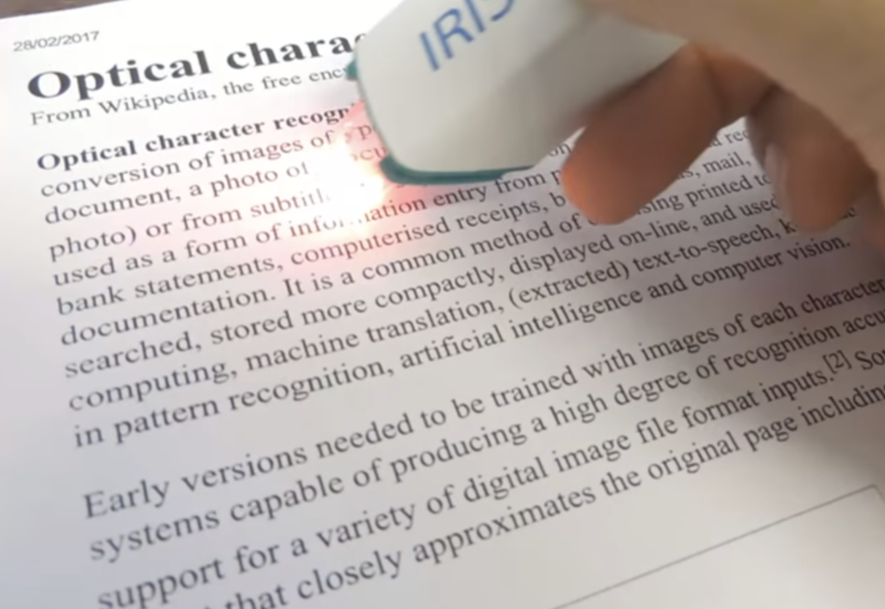
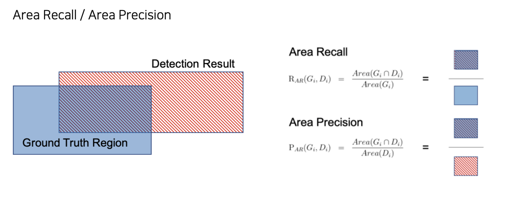

## 🧾Overview

스마트폰으로 카드를 결제하거나, 카메라로 카드를 인식할 경우 자동으로 카드 번호가 입력되는 경우가 있습니다. 또 주차장에 들어가면 차량 번호가 자동으로 인식되는 경우도 흔히 있습니다. 이처럼 OCR (Optimal Character Recognition) 기술은 사람이 직접 쓰거나 이미지 속에 있는 문자를 얻은 다음 이를 컴퓨터가 인식할 수 있도록 하는 기술로, 컴퓨터 비전 분야에서 현재 널리 쓰이는 대표적인 기술 중 하나입니다.

## 🧙‍♂️Team

|                                                                           [김지현](https://github.com/codehyunn)                                                                           |                                                                           [박상필](https://github.com/SangphilPark)                                                                           |                                                                           [오동혁](https://github.com/97DongHyeokOH)                                                                           |                                                                           [이상민](https://github.com/dldltkdals)                                                                           |                                                                           [이태순](https://github.com/LTSGOD)                                                                           |
| :--------------------------------------------------------------------------------------------------------------------------------------------------------: | :--------------------------------------------------------------------------------------------------------------------------------------------------------: | :--------------------------------------------------------------------------------------------------------------------------------------------------------: | :--------------------------------------------------------------------------------------------------------------------------------------------------------: | :--------------------------------------------------------------------------------------------------------------------------------------------------------: |
|  |  |  |  |  |

## 🥈LB Score

- private : 0.9807 (2등 / 19팀)
- public : 0.9844 (2등 / 19팀)

## ⭐Project Summary

- **EDA** : 배경노이즈, 바코드 주변의 작은 글씨를 인식하지 못하는 등의 특징 포착
- **Crop** : EDA를 통해 확인한 노이즈를 해결하기 위해 배경과 QR코드를 포함하도록 crop하여 학습하는 실험 진행
- **pre-trained model** :  target data와 비슷한 외부 데이터를 학습하고  target data로 fine tuning
- **CutMix** : 배경에 대한 예측을 하지 않게 학습시키기 위해 배경과 영수증을 Cutmix
- **multi scale training** : 기존 scale 로 학습시 작은 글자들이 검출되지 않거나 빈 박스 생기는 문제 확인 후 다양한 size로 resize한 후 crop

## 📈Model performance

|       개선시도       |  실험 후 f1 score  | f1 score 증감 |
| :----------------: | :--------: | :-------------: |
|     **baseline**     | **0.9618** |   **0**    |
| Crop Augmentation |   0.9719   |   +0.0101    |
|    pretrained model fine tuning     |   0.9802   |   +0.0184    |
|        multi scale training       |   0.9820   |     +0.0202     |
|    Cutmix Augmentation    |   0.9813   |     +0.0195      |
|  Blur Augmentation (Kernel Size=11)   |   0.9844  |     +0.0226      |

## 💾Datasets

- train: 300장의 train image 존재
- test: 100장의 test image 존재
- train.json: train image에 대한 annotation file (UFO format)
- test.json: test image에 대한 annotation file (UFO  format)
- 출처 : 부스트캠프 AI Tech

## 📊Metric
- **DetEval**
  - 이미지 레벨에서 정답 박스가 여러개 존재하고, 예측한 박스가 여러개가 있을 경우, 박스끼리의 다중 매칭을 허용하여 점수를 주는 평가방법 중 하나
  - GT 박스 중 'masked', 'maintable', 'excluded-region', 'stamp' tag 중 하나의 항목이라도 포함하고있는 박스에 대해서는 평가진행 하지 않음.
- **평가절차**
  1. 모든 정답/예측박스들에 대해서 Area Recall, Area Precision을 미리 계산
  2. 모든 정답 박스와 예측 박스를 순회하면서, 매칭이 되었는지 판단하여 박스 레벨로 정답 여부를 측정
  3.  모든 이미지에 대하여 Recall, Precision을 구한 이후, 최종 F1-Score은 모든 이미지 레벨에서 측정 값의 평균으로 측정 

## ⚒Development Environment

- GPU : v100
- OS : linux
- library : pytorch
